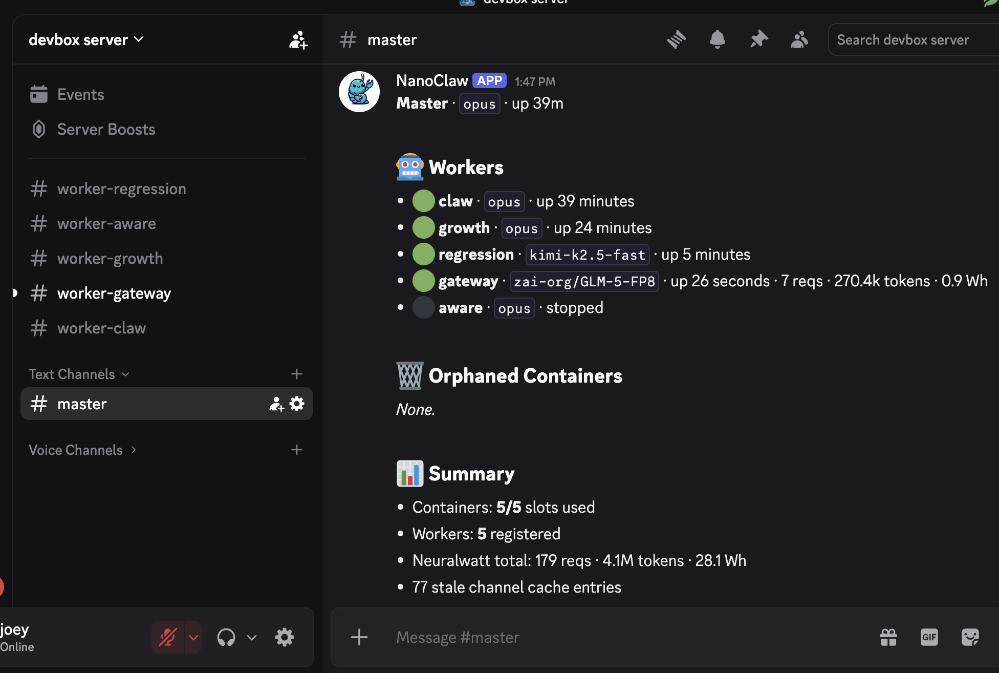
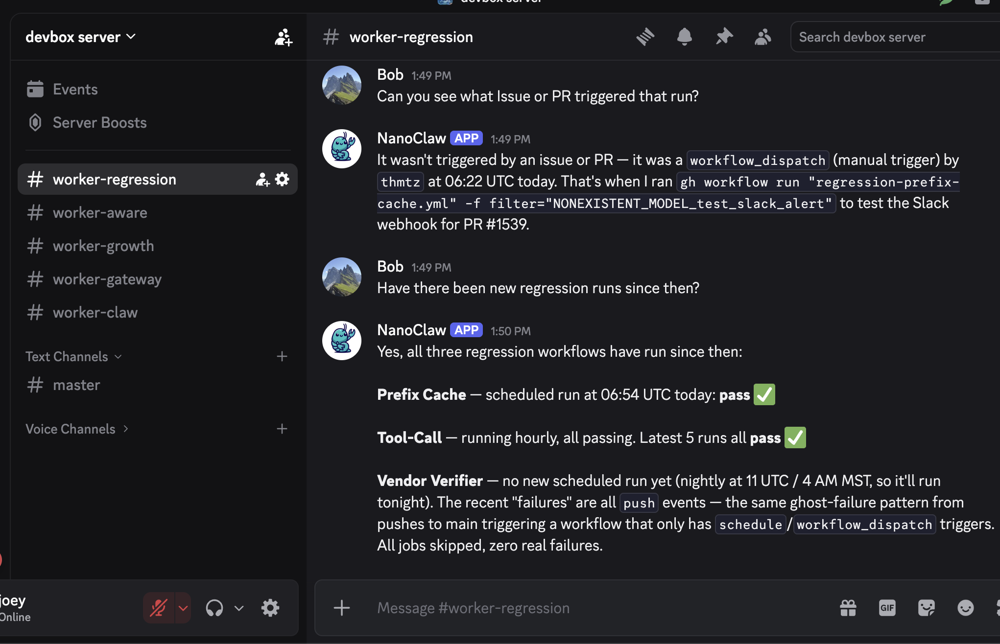

# NanoClaw Fleet

A fleet manager for isolated coding agents, built on [NanoClaw](https://github.com/qwibitai/nanoclaw). Each agent gets its own Discord channel and Docker container with pre-cloned repos and tools. You manage everything from a master channel: create workers, give them tasks, switch between contexts, tear them down when done.

I built this because I wanted to run multiple coding agents in parallel without juggling shell sessions and worktrees, and I wanted seamless handoff between desktop and mobile. Discord gives you both: each worker is just a channel you can check in on from anywhere.



## What a session looks like

In `#master`:

```
create a worker named fix-auth
create a worker named refactor-api
create a worker named update-docs
```

Each one gets a Discord channel, a Docker container, and your repos cloned. Switch between channels to give tasks, check progress, or follow up. Come back later from your phone and pick up where you left off.

Workers persist until you explicitly destroy them. If you destroy one by mistake, recreating it with the same name restores the workspace and conversation history.

## Quick Start

```bash
git clone https://github.com/thmtz/nanoclaw-fleet.git && cd nanoclaw-fleet
claude   # or your coding agent of choice
```

Then run `/setup`. The setup skill walks you through everything: dependencies, Docker, Discord bot, worker profiles, and service configuration. It handles the work automatically and only pauses when it needs your input (creating a Discord bot, pasting tokens, etc.).

If you prefer to set things up manually, the [full setup guide](docs/guides/setup.md) has step-by-step instructions. The short version:

1. Fork and clone this repo
2. Create a Discord server + bot with Manage Channels permission
3. Configure `.env` (bot token, guild ID, model, GitHub PAT path)
4. Set up worker profiles in `~/.config/nanoclaw/worker-profiles/`
5. `npm run build && systemctl --user start nanoclaw`
6. In `#master`: "create a worker named my-task"

## Using Workers

All interaction happens in Discord. You talk to the **master agent** in `#master`, and it manages workers on your behalf.

### Creating Workers

By default, workers run on **Claude (Opus)** via the Anthropic API:

```
create a worker named my-task
```

To use an open-source model via [Neuralwatt](https://portal.neuralwatt.com), specify the backend and model. Neuralwatt's API reports energy consumption per request (joules, watt-hours), so you can track exactly how much power each worker uses.

```
create a worker named my-task based on neuralwatt kimi k2.5
```

The master resolves fuzzy model names automatically. "kimi fast", "qwen coder", etc. all work.

### Switching Models

**Within Neuralwatt**, model switches are instant, no restart needed:

```
switch my-task to qwen 3.5
```

**Between Anthropic and Neuralwatt**, just ask the master. Workspace and chat history are preserved:

```
switch my-task to neuralwatt kimi k2.5
```

### Listing and Destroying Workers

```
list workers
destroy my-task
```

### Session Restore

Workers keep their workspace and conversation history after being destroyed. Recreating a worker with the same name picks up where it left off:

```
destroy my-task
create a worker named my-task    # resumes previous session
```

The master will ask whether to resume or start fresh if a previous session exists.

### Viewing Energy and Usage Data

Neuralwatt workers track per-request energy metrics (tokens, joules, watt-hours).

**Status dashboard**: ask the master to run `/status`:

```
show /status
```

```
Master · claude · up 2h 15m

## Workers
- 🟢 my-task · moonshotai/Kimi-K2.5 · up 45m · 12 reqs · 8.3k tokens · 0.4 Wh
- 🟢 other-task · claude · up 1h
- ⚫ old-task · claude · stopped

## Summary
- Containers: 2/5 slots used
- Workers: 3 registered
- Neuralwatt total: 12 reqs · 8.3k tokens · 0.4 Wh
```

**On worker destruction**: lifetime usage is reported automatically for Neuralwatt workers.

**Direct query**:

```bash
curl http://host.docker.internal:3003/usage           # all workers
curl http://host.docker.internal:3003/usage/discord_my-task  # single worker
```



## CLI Reference

The `ncf` CLI provides admin operations from the host machine:

```bash
./ncf status                    # Show all workers and containers
./ncf status --json             # JSON output for scripts
./ncf logs <worker>             # Audit logs (--cache, --slow, --follow)
./ncf inject <channel> <msg>    # Inject message (--wait for response)
./ncf switch <w> <backend> [m]  # Switch backend (anthropic/neuralwatt)
./ncf restart <worker>          # Restart container (--fresh to clear history)
./ncf create <name>             # Create worker
./ncf destroy <worker>          # Destroy worker (keeps workspace)
./ncf session <worker>          # Show session transcript
./ncf history [worker]          # Worker lifecycle events
./ncf debug                     # System state dump
./ncf rebuild                   # Rebuild container image
```

## Architecture

```
Discord Server
  #master          <-->  NanoClaw host  <-->  Master agent (lifecycle only)
  #worker-alpha    <-->       |         <-->  Container A (Claude or Neuralwatt)
  #worker-beta     <-->       |         <-->  Container B (Claude or Neuralwatt)
```

One Discord bot. The host process routes messages by channel ID. Workers are isolated containers with their own filesystems and Claude sessions. The master calls MCP tools (create, destroy, list, switch) with the right arguments. Workers handle all the real work.

### Configuration Model

Configuration splits along two axes: **shared** (in the repo, for all users) vs **personal** (`~/.config/nanoclaw/`, your setup), and **global** (all agents) vs **role-specific** (master-only or worker-only).

| What                | Repo (shared)                            | Personal (`~/.config/nanoclaw/`)           |
| ------------------- | ---------------------------------------- | ------------------------------------------ |
| **Instructions**    | `instructions/{global,master,worker}.md` | `instructions/{global,master,worker}.md`   |
| **Container image** | `container/Dockerfile`                   | `Dockerfile` (layered on top)              |
| **Worker config**   | `worker-profiles/example.json`           | `worker-profiles/default.json` + `init.sh` |

At startup, NanoClaw assembles each agent's CLAUDE.md from four fragments: repo global, repo role, personal global, personal role. The container image works the same way. The repo provides generic behavior; your personal config adds your workflow, repos, tools, and conventions.

See [docs/guides/personal-config.md](docs/guides/personal-config.md) for the full config reference with examples.

### Inference Backends

The system uses a translation shim (port 3003) that converts between Anthropic and OpenAI API formats. Workers always use the Claude Agent SDK. The shim handles translation transparently for Neuralwatt workers. Anthropic workers talk directly to the credential proxy (port 3001).

For technical details: [inference routing](docs/architecture/inference-routing.md) · [model discovery](docs/architecture/model-discovery.md) · [energy tracking](docs/architecture/energy-tracking.md)

### Restart Behavior

Containers run with `--rm` and are destroyed on NanoClaw restart. Everything else persists: Discord channels, SQLite registrations, repos (bind-mounted workspace), and session IDs. On restart, workers respawn on next message with full context.

See [docs/architecture/container-lifecycle.md](docs/architecture/container-lifecycle.md).

## Documentation

| Section                                  | What's in it                                                   |
| ---------------------------------------- | -------------------------------------------------------------- |
| [docs/architecture/](docs/architecture/) | How the system works (overview, routing, lifecycle, streaming) |
| [docs/guides/](docs/guides/)             | Setup, personal config, testing, troubleshooting               |
| [docs/reference/](docs/reference/)       | SDK internals                                                  |
| [design/](design/)                       | Design history and archived proposals                          |

Full index: [docs/README.md](docs/README.md)

## Development

```bash
npm run dev          # Run with hot reload
npm run build        # Compile TypeScript
./container/build.sh # Rebuild agent container image

# Service management (Linux)
systemctl --user start nanoclaw
systemctl --user restart nanoclaw
```

Pre-push hook runs prettier, tsc, and tests. Enable with `git config core.hooksPath .githooks`.

## Upstream

This fork tracks [qwibitai/nanoclaw](https://github.com/qwibitai/nanoclaw). Use the `/migrate-nanoclaw` skill for guided upgrades, or `/update-nanoclaw` for lightweight cherry-picks.
